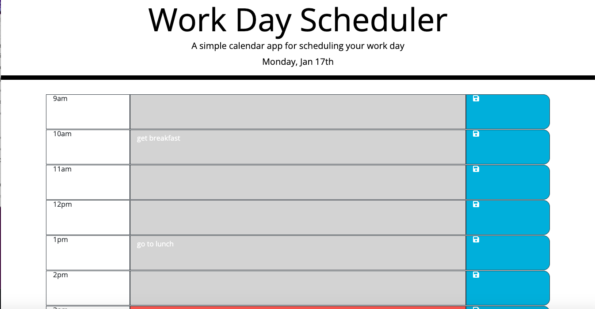
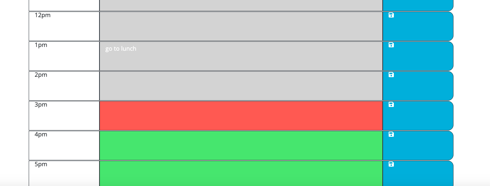

# 05 Third-Party APIs: Work Day Scheduler

## The Project
For this project we had to create a work day scheduler for an employee with a busy schedule.

The planner needs to display the current day at the top of the calander. When the user scrolls down then the user is presented with timeblocks. When the timeblocks are viewed they need to be color coded to indicate wether it is in the past, present or future. When the user clicks on a timeblock, they can enter an event. When they click save the save button for the timeblock then the text for that event is saved into the local storage. When the user refreshes the page, then the saved event persists.

One thing i added ontop was to clear the local storage at the end of each workday so that the user is presented with a fresh day planner for the next day.

## Mock Up

## Finished Product

> **Note** : This shows the landing page.

> **Note** : This shows one of the questions.

> **Note** : This shows wether the last answer was correct.

> **Note** : This shows where you log your score.

> **Note** : This shows the highscore leaderboard.

## A link to the webpage is shown below:
https://lconnell1000.github.io/codingQuiz/